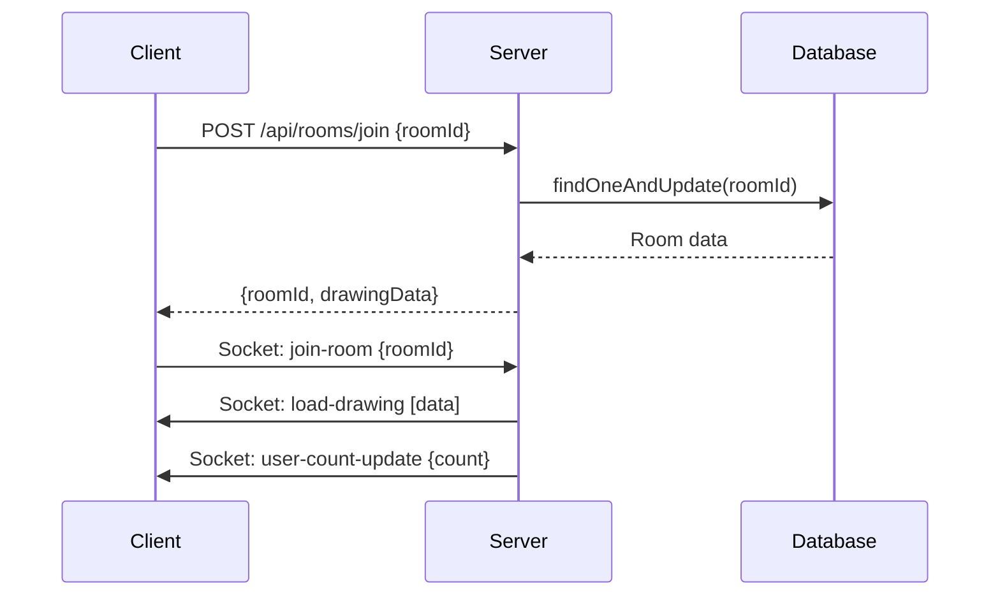
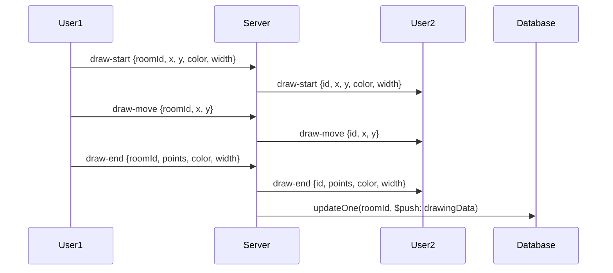
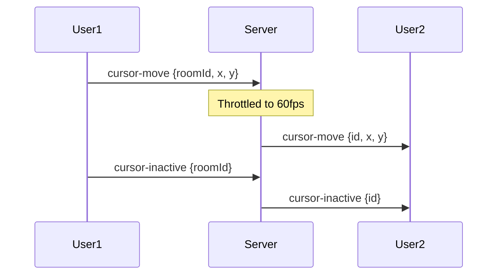

# Architecture Overview

This document provides a comprehensive overview of the Collaborative WhiteBoard application's architecture, system design, and component interactions.

## System Architecture

The application follows a **client-server architecture** with real-time communication capabilities, designed for scalability and maintainability.

```
┌─────────────────┐    HTTP/REST    ┌─────────────────┐
│   React Client  │◄──────────────►│  Node.js Server │
│   (Frontend)    │                 │   (Backend)     │
└─────────────────┘                 └─────────────────┘
         │                                   │
         │ WebSocket/Socket.io               │
         │ (Real-time)                       │
         └───────────────────────────────────┘
                                              │
                                              ▼
                                    ┌─────────────────┐
                                    │    MongoDB      │
                                    │   (Database)    │
                                    └─────────────────┘
```

## Component Architecture

### Frontend (React Client)

The frontend is built with React and follows a component-based architecture:

```
src/
├── components/
│   ├── Canvas/           # Main drawing canvas component
│   ├── RoomEntry/        # Room joining interface
│   ├── Toolbar/          # Drawing tools and controls
│   └── UserInfo/         # User count and status display
├── hooks/
│   ├── useSocket.js      # Socket.io connection management
│   └── useDrawing.js     # Drawing state and logic
├── utils/
│   └── drawingUtils.js   # Drawing calculation utilities
└── App.js               # Main application component
```

**Key Frontend Components:**

1. **Canvas Component**
   - HTML5 Canvas for drawing
   - Mouse/touch event handling
   - Real-time drawing synchronization
   - Cursor tracking display

2. **Socket Hook**
   - Manages WebSocket connections
   - Handles real-time events
   - Connection state management
   - Automatic reconnection

3. **Drawing Hook**
   - Drawing state management
   - Stroke data processing
   - Color and brush settings
   - Canvas clearing functionality

### Backend (Node.js Server)

The backend follows a modular architecture with clear separation of concerns:

```
server/
├── server.js            # Main server entry point
├── models/
│   └── Room.js          # MongoDB schema and model
├── routes/
│   └── rooms.js         # REST API endpoints
├── socket/
│   └── socketHandler.js # Socket.io event handlers
└── middleware/          # Express middleware (future)
```

**Key Backend Components:**

1. **Express Server**
   - HTTP server setup
   - CORS configuration
   - Route handling
   - Error handling

2. **Socket.io Handler**
   - Real-time event processing
   - Room management
   - Drawing synchronization
   - User tracking

3. **MongoDB Models**
   - Room data persistence
   - Drawing command storage
   - Activity tracking

## Data Flow

### 1. Room Creation/Joining Flow



### 2. Real-time Drawing Flow



### 3. Cursor Tracking Flow



## Data Models

### Room Schema

```javascript
{
  roomId: String,           // 6-8 character unique identifier
  drawingData: [            // Array of drawing commands
    {
      type: String,         // 'stroke' or 'clear'
      data: Object,         // Drawing data (points, color, width)
      timestamp: Date       // When the command was created
    }
  ],
  lastActivity: Date,       // Last activity timestamp
  createdAt: Date,          // Room creation timestamp
  updatedAt: Date           // Last update timestamp
}
```

### Drawing Command Types

1. **Stroke Command**
   ```javascript
   {
     type: 'stroke',
     data: {
       points: [{x: number, y: number}],
       color: '#000000',
       width: 2
     },
     timestamp: Date
   }
   ```

2. **Clear Command**
   ```javascript
   {
     type: 'clear',
     data: {},
     timestamp: Date
   }
   ```

## Scalability Considerations

### Current Architecture Limitations

1. **Single Server Instance**
   - All WebSocket connections on one server
   - No horizontal scaling support
   - Memory constraints with many concurrent users

2. **Database Bottlenecks**
   - Single MongoDB instance
   - No read/write separation
   - Potential performance issues with large drawings

### Scalability Improvements

1. **Multi-Server Setup**
   ```
   ┌─────────────────┐    ┌─────────────────┐
   │   Load Balancer │───►│  Server Instance 1 │
   └─────────────────┘    └─────────────────┘
         │                        │
         └───────────────────────►│
                                  ▼
   ┌─────────────────┐    ┌─────────────────┐
   │   Redis Pub/Sub │◄───│  Server Instance 2 │
   └─────────────────┘    └─────────────────┘
   ```

2. **Database Optimization**
   - MongoDB replica sets for read scaling
   - Connection pooling
   - Index optimization
   - Data archiving for old rooms

3. **Caching Strategy**
   - Redis for session management
   - In-memory caching for active rooms
   - CDN for static assets

## Security Architecture

### Current Security Measures

1. **Input Validation**
   - Room ID format validation (6-8 characters)
   - Drawing data validation
   - CORS configuration

2. **Data Sanitization**
   - MongoDB injection prevention
   - XSS protection through React
   - Input sanitization

### Security Improvements

1. **Authentication & Authorization**
   - User authentication system
   - Room access control
   - Rate limiting

2. **Data Protection**
   - HTTPS enforcement
   - API key management
   - Request signing

## Performance Optimization

### Current Optimizations

1. **Socket.io Optimizations**
   - Cursor movement throttling (60fps)
   - Room-based event broadcasting
   - Efficient event handling

2. **Database Optimizations**
   - Indexed roomId field
   - Efficient queries with projection
   - Automatic cleanup of old rooms

### Performance Monitoring

1. **Metrics to Track**
   - WebSocket connection count
   - Drawing events per second
   - Database query performance
   - Memory usage

2. **Monitoring Tools**
   - Application performance monitoring (APM)
   - Database monitoring
   - Real-time metrics dashboard

## Deployment Architecture

### Development Environment
```
┌─────────────────┐    ┌─────────────────┐
│   React Dev     │    │  Node.js Dev    │
│   (Port 3000)   │    │  (Port 5000)    │
└─────────────────┘    └─────────────────┘
                              │
                              ▼
                    ┌─────────────────┐
                    │  MongoDB Local  │
                    └─────────────────┘
```

### Production Environment
```
┌─────────────────┐    ┌─────────────────┐
│   CDN/Static    │    │  Load Balancer  │
│   Assets        │    └─────────────────┘
└─────────────────┘            │
                              ▼
                    ┌─────────────────┐
                    │  Server Cluster │
                    │  (Multiple      │
                    │   Instances)    │
                    └─────────────────┘
                              │
                              ▼
                    ┌─────────────────┐
                    │  MongoDB Atlas  │
                    │  (Cloud DB)     │
                    └─────────────────┘
```

## Future Architecture Considerations

### Microservices Approach
- Separate drawing service
- User management service
- Room management service
- Real-time communication service

### Event-Driven Architecture
- Message queues for drawing events
- Event sourcing for drawing history
- CQRS pattern for read/write separation

### Cloud-Native Deployment
- Container orchestration (Kubernetes)
- Auto-scaling based on load
- Multi-region deployment
- Serverless functions for specific tasks

## Technology Stack Summary

| Component | Technology | Purpose |
|-----------|------------|---------|
| Frontend | React 18 | User interface |
| Real-time | Socket.io | WebSocket communication |
| Backend | Node.js + Express | API server |
| Database | MongoDB + Mongoose | Data persistence |
| Styling | Styled Components | CSS-in-JS |
| Routing | React Router | Client-side routing |
| Development | Concurrently | Multi-process development |

This architecture provides a solid foundation for the collaborative whiteboard application while maintaining flexibility for future enhancements and scaling requirements. 